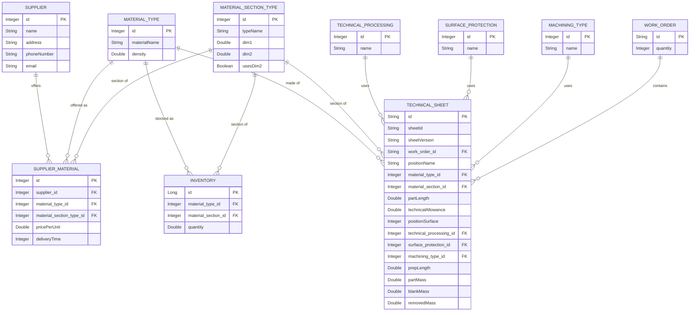

# Database schema

Generated from the JPA entities in `src/main/java/com/mpo/entity`. Reflects the schema as of commit `73fccb5`.

## Entity relationship diagram

## Tables

### `supplier`
Companies that sell raw material. | Entity: `Supplier`

| Column | Type | Notes |
|---|---|---|
| id | Integer | PK, auto-generated (`IDENTITY`) |
| name | String | |
| address | String | |
| phoneNumber | String | |
| email | String | |

### `supplier_material`
An "offer": one supplier's price/lead time for a material type + section (each `material_section_type` row is already a specific size, e.g. "ROUND 30", so the section reference alone pins down the dimensions). Many-to-many join between `supplier` and `material_type`/`material_section_type`, carrying price and delivery data. | Entity: `SupplierMaterial`

| Column | Type | Notes |
|---|---|---|
| id | Integer | PK, auto-generated (`IDENTITY`) |
| supplier_id | Integer | FK &rarr; `supplier.id` |
| material_type_id | Integer | FK &rarr; `material_type.id` |
| material_section_type_id | Integer | FK &rarr; `material_section_type.id` |
| pricePerUnit | Double | price per unit of measure |
| deliveryTime | Integer | lead time, in days |

### `material_type`
Lookup table of raw material types (e.g. steel grades). | Entity: `MaterialType`

| Column | Type | Notes |
|---|---|---|
| id | Integer | PK, **not** auto-generated — assigned manually (seed/reference data) |
| materialName | String | |
| density | Double | used in mass calculations (`TechnicalSheetService`) |

### `material_section_type`
Lookup table of cross-section shapes (round, square, rectangle, hex, tube). | Entity: `MaterialSectionType`

| Column | Type | Notes |
|---|---|---|
| id | Integer | PK, **not** auto-generated |
| typeName | String | stored via `@Enumerated(EnumType.STRING)` from `com.mpo.enums.SectionShape`: `ROUND`, `CUBE`, `RECTANGULAR`, `HEXAGONAL`, `PIPE` (see `TechnicalSheetService.calculateVolume`) |
| dim1 | Double | this row's concrete dimension (e.g. diameter/side length) — each shape+size combo is its own row (e.g. "ROUND 30", "ROUND 40") |
| dim2 | Double | e.g. second side for `RECTANGLE`/inner diameter for `TUBE`; nullable |
| usesDim2 | Boolean | whether `dim2` is required for this shape |

> Since every row already pins one concrete size, `Inventory` and `SupplierMaterial` no longer duplicate `dim1`/`dim2` themselves — they just reference the exact `material_section_type` row they need.

### `inventory`
Stock on hand for a given material/section/dimension combination. | Entity: `Inventory`

| Column | Type | Notes |
|---|---|---|
| id | Long | PK, auto-generated (`IDENTITY`) |
| material_type_id | Integer | FK &rarr; `material_type.id` |
| material_section_id | Integer | FK &rarr; `material_section_type.id` |
| quantity | Double | total length available in stock |

### `work_order`
A production order ("radni nalog"). | Entity: `WorkOrder`

| Column | Type | Notes |
|---|---|---|
| id | String | PK, business key (e.g. `RN-2025-001`) |
| quantity | Integer | number of pieces |
| — | `List<TechnicalSheet>` | inverse side of `TechnicalSheet.workOrder`, not a column |

### `technical_sheet`
A technical drawing/spec for one position within a work order; multiple versions can exist per `sheetId`. | Entity: `TechnicalSheet`

| Column | Type | Notes |
|---|---|---|
| id | String | PK |
| sheetId | String | groups versions of the same sheet |
| sheetVersion | String | version identifier, sortable |
| work_order_id | String | FK &rarr; `work_order.id` |
| positionName | String | |
| material_type_id | Integer | FK &rarr; `material_type.id` |
| material_section_id | Integer | FK &rarr; `material_section_type.id` |
| partLength | Double | finished part length |
| technicalAllowance | Double | added stock/allowance |
| positionSurface | Integer | |
| technical_processing_id | Integer | FK &rarr; `technical_processing.id` |
| surface_protection_id | Integer | FK &rarr; `surface_protection.id` |
| machining_type_id | Integer | FK &rarr; `machining_type.id` |
| prepLength | Double | computed: `partLength + technicalAllowance` |
| partMass | Double | computed from section geometry + density |
| blankMass | Double | computed from `prepLength` + density |
| removedMass | Double | computed: `blankMass - partMass` |

### `technical_processing`
Lookup table of heat/technical treatment types (e.g. "Kaljenje"). | Entity: `TechnicalProcessing`

| Column | Type | Notes |
|---|---|---|
| id | Integer | PK, **not** auto-generated |
| name | String | |

### `surface_protection`
Lookup table of surface finishing types (e.g. "Lakiranje"). | Entity: `SurfaceProtection`

| Column | Type | Notes |
|---|---|---|
| id | Integer | PK, **not** auto-generated |
| name | String | |

### `machining_type`
Lookup table of machining operations (e.g. "Struganje"). | Entity: `MachiningType`

| Column | Type | Notes |
|---|---|---|
| id | Integer | PK, **not** auto-generated |
| name | String | |

## Relationship summary

- **Supplier &rarr; SupplierMaterial**: one supplier can have many offers (1:N).
- **MaterialType / MaterialSectionType &rarr; SupplierMaterial**: each offer is for one material type + section type (the section type row already carries its concrete size); a given material/section combo can have offers from many suppliers (this is the set `SupplierMaterialService.findOptimal` picks from).
- **MaterialType / MaterialSectionType &rarr; Inventory**: same shape as above, but for stock on hand rather than supplier offers.
- **MaterialType / MaterialSectionType / TechnicalProcessing / SurfaceProtection / MachiningType &rarr; TechnicalSheet**: each technical sheet references one of each (material, section, processing, protection, machining).
- **WorkOrder &rarr; TechnicalSheet**: one work order contains many technical sheets (1:N, `mappedBy = "workOrder"`).

Note the five lookup/reference entities (`MaterialType`, `MaterialSectionType`, `MachiningType`, `SurfaceProtection`, `TechnicalProcessing`) all use manually-assigned IDs rather than `@GeneratedValue` — they're meant to be seeded rather than created through the API.

`MaterialSectionType` rows are size-specific (e.g. "ROUND 30", "ROUND 40" are separate rows), so `dim1`/`dim2` live only there — `Inventory` and `SupplierMaterial` reference a section type row directly instead of repeating the dimensions.
