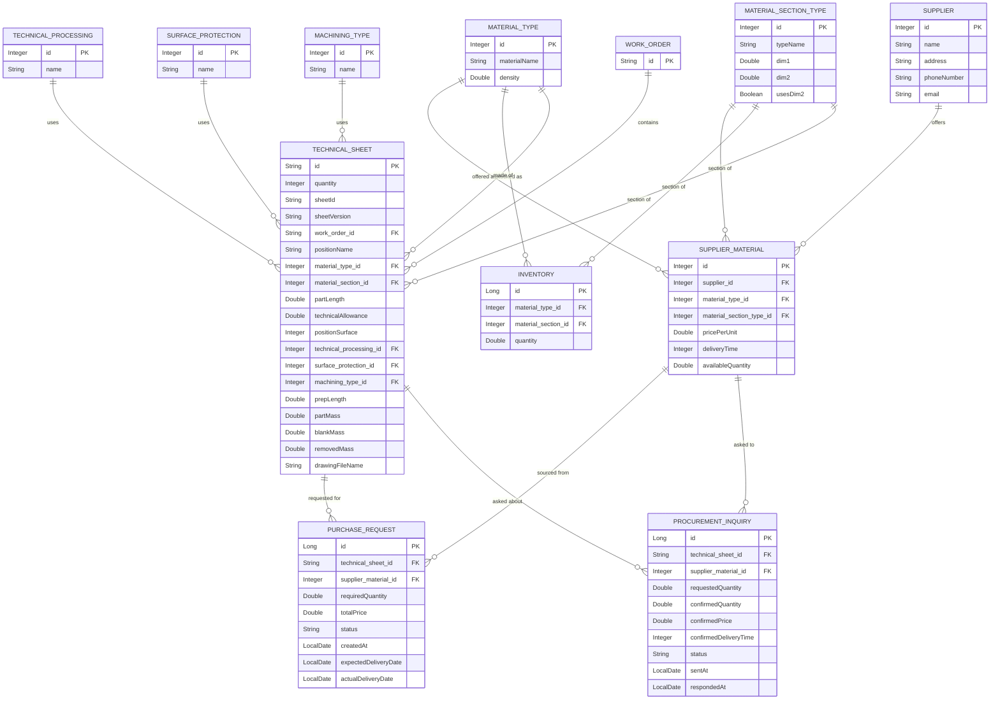

# Database schema

Generated from the JPA entities in `src/main/java/com/mpo/entity`. Reflects the schema as of commit `a163edc`.

## Entity relationship diagram

## Tables

### `supplier`
Companies that sell raw material. | Entity: `Supplier`

| Column | Type | Notes |
|---|---|---|
| id | Integer | PK, auto-generated (`IDENTITY`) |
| name | String | |
| address | String | |
| phoneNumber | String | |
| email | String | |

### `supplier_material`
An "offer": one supplier's price/lead time/stock for a material type + section (each `material_section_type` row is already a specific size, e.g. "ROUND 30", so the section reference alone pins down the dimensions). Many-to-many join between `supplier` and `material_type`/`material_section_type`, carrying price, delivery, and quantity data. | Entity: `SupplierMaterial`

| Column | Type | Notes |
|---|---|---|
| id | Integer | PK, auto-generated (`IDENTITY`) |
| supplier_id | Integer | FK &rarr; `supplier.id` |
| material_type_id | Integer | FK &rarr; `material_type.id` |
| material_section_type_id | Integer | FK &rarr; `material_section_type.id` |
| pricePerUnit | Double | price per unit of measure |
| deliveryTime | Integer | lead time, in days |
| availableQuantity | Double | quantity the supplier currently has on hand; depletes as purchase requests are created against this offer, restored on cancellation, overwritten when a `ProcurementInquiry` response comes back |

### `material_type`
Lookup table of raw material types (e.g. steel grades). | Entity: `MaterialType`

| Column | Type | Notes |
|---|---|---|
| id | Integer | PK, **not** auto-generated — assigned manually (seed/reference data) |
| materialName | String | |
| density | Double | used in mass calculations (`TechnicalSheetService`) |

### `material_section_type`
Lookup table of cross-section shapes (round, square, rectangle, hex, tube). | Entity: `MaterialSectionType`

| Column | Type | Notes |
|---|---|---|
| id | Integer | PK, **not** auto-generated |
| typeName | String | stored via `@Enumerated(EnumType.STRING)` from `com.mpo.enums.SectionShape`: `ROUND`, `CUBE`, `RECTANGULAR`, `HEXAGONAL`, `PIPE` (see `TechnicalSheetService.calculateVolume`) |
| dim1 | Double | this row's concrete dimension (e.g. diameter/side length) — each shape+size combo is its own row (e.g. "ROUND 30", "ROUND 40") |
| dim2 | Double | e.g. second side for `RECTANGLE`/inner diameter for `TUBE`; nullable |
| usesDim2 | Boolean | whether `dim2` is required for this shape |

> Since every row already pins one concrete size, `Inventory` and `SupplierMaterial` no longer duplicate `dim1`/`dim2` themselves — they just reference the exact `material_section_type` row they need.

### `inventory`
Stock on hand for a given material/section/dimension combination. | Entity: `Inventory`

| Column | Type | Notes |
|---|---|---|
| id | Long | PK, auto-generated (`IDENTITY`) |
| material_type_id | Integer | FK &rarr; `material_type.id` |
| material_section_id | Integer | FK &rarr; `material_section_type.id` |
| quantity | Double | total length available in stock (mm) |

### `work_order`
A production order ("radni nalog"). | Entity: `WorkOrder`

| Column | Type | Notes |
|---|---|---|
| id | String | PK, business key (e.g. `RN-2025-001`) |
| — | `List<TechnicalSheet>` | inverse side of `TechnicalSheet.workOrder`, not a column |

### `technical_sheet`
A technical spec sheet for one position within a work order (numeric/material parameters, not a CAD drawing); multiple versions can exist per `sheetId`. Can have an uploaded reference drawing attached. | Entity: `TechnicalSheet`

| Column | Type | Notes |
|---|---|---|
| id | String | PK |
| quantity | Integer | number of pieces for this position |
| sheetId | String | groups versions of the same sheet |
| sheetVersion | String | version identifier, sortable |
| work_order_id | String | FK &rarr; `work_order.id` |
| positionName | String | free text, user-entered, no uniqueness/format constraint |
| material_type_id | Integer | FK &rarr; `material_type.id` |
| material_section_id | Integer | FK &rarr; `material_section_type.id` |
| partLength | Double | finished part length |
| technicalAllowance | Double | added stock/allowance |
| positionSurface | Integer | |
| technical_processing_id | Integer | FK &rarr; `technical_processing.id` |
| surface_protection_id | Integer | FK &rarr; `surface_protection.id` |
| machining_type_id | Integer | FK &rarr; `machining_type.id` |
| prepLength | Double | computed: `partLength + technicalAllowance` |
| partMass | Double | computed from section geometry + density |
| blankMass | Double | computed from `prepLength` + density |
| removedMass | Double | computed: `blankMass - partMass` |
| drawingFileName | String | original filename of the uploaded client drawing, nullable; the actual file lives on local disk (`uploads/drawings/{id}.{ext}`), **not** in the database — this column is just the reference used for content-type detection and `Content-Disposition` on download |

### `technical_processing`
Lookup table of heat/technical treatment types (e.g. "Kaljenje"). | Entity: `TechnicalProcessing`

| Column | Type | Notes |
|---|---|---|
| id | Integer | PK, **not** auto-generated |
| name | String | |

### `surface_protection`
Lookup table of surface finishing types (e.g. "Lakiranje"). | Entity: `SurfaceProtection`

| Column | Type | Notes |
|---|---|---|
| id | Integer | PK, **not** auto-generated |
| name | String | |

### `machining_type`
Lookup table of machining operations (e.g. "Struganje"). | Entity: `MachiningType`

| Column | Type | Notes |
|---|---|---|
| id | Integer | PK, **not** auto-generated |
| name | String | |

### `purchase_request`
A real, committed order: this material, from this supplier, for this position, in this quantity. Created by `ProcurementOptimizationService` (never manually), tracked through a linear status lifecycle. | Entity: `PurchaseRequest`

| Column | Type | Notes |
|---|---|---|
| id | Long | PK, auto-generated (`IDENTITY`) |
| technical_sheet_id | String | FK &rarr; `technical_sheet.id` — one position can have **multiple** purchase requests if demand was split across suppliers |
| supplier_material_id | Integer | FK &rarr; `supplier_material.id` |
| requiredQuantity | Double | quantity ordered from this specific offer (mm) — the position's total need minus whatever inventory/other suppliers already covered |
| totalPrice | Double | `requiredQuantity × pricePerUnit` at creation time |
| status | String | enum `PurchaseRequestStatus`: `CREATED` &rarr; `SENT` &rarr; `IN_DELIVERY` &rarr; `DELIVERED`, or `CANCELED` from any non-terminal state; backward transitions blocked |
| createdAt | LocalDate | |
| expectedDeliveryDate | LocalDate | `createdAt + deliveryTime` (days) from the offer |
| actualDeliveryDate | LocalDate | set when status reaches `DELIVERED`; nullable until then |

### `procurement_inquiry`
A request-for-quote sent to a supplier to confirm real price/delivery/quantity before committing an order — separate from `purchase_request` because it does not represent a real order, just a question. | Entity: `ProcurementInquiry`

| Column | Type | Notes |
|---|---|---|
| id | Long | PK, auto-generated (`IDENTITY`) |
| technical_sheet_id | String | FK &rarr; `technical_sheet.id`, **nullable** — null means a "general" inquiry sent directly from the Suppliers page, not tied to any specific position/need |
| supplier_material_id | Integer | FK &rarr; `supplier_material.id` |
| requestedQuantity | Double | the position's computed need at the time the inquiry was sent; null for general inquiries |
| confirmedQuantity | Double | supplier's confirmed answer; null until answered |
| confirmedPrice | Double | supplier's confirmed price per unit; null until answered |
| confirmedDeliveryTime | Integer | supplier's confirmed lead time (days); null until answered |
| status | String | enum `ProcurementInquiryStatus`: `POSLAT` &rarr; `ODGOVOREN`; answering is a one-way transition (already-answered inquiries reject a second response) |
| sentAt | LocalDate | |
| respondedAt | LocalDate | nullable until answered |

> Answering an inquiry (`ProcurementInquiryService.recordResponse`) writes `confirmedQuantity`/`confirmedPrice`/`confirmedDeliveryTime` back onto the referenced `supplier_material` row in one shot (`SupplierMaterialService.updateSupplierMaterial`), overwriting the previously approximate values.

## Relationship summary

- **Supplier &rarr; SupplierMaterial**: one supplier can have many offers (1:N).
- **MaterialType / MaterialSectionType &rarr; SupplierMaterial**: each offer is for one material type + section type (the section type row already carries its concrete size); a given material/section combo can have offers from many suppliers (this is the set `SupplierMaterialService.allocate` picks from, potentially splitting demand across several).
- **MaterialType / MaterialSectionType &rarr; Inventory**: same shape as above, but for stock on hand rather than supplier offers.
- **MaterialType / MaterialSectionType / TechnicalProcessing / SurfaceProtection / MachiningType &rarr; TechnicalSheet**: each technical sheet references one of each (material, section, processing, protection, machining).
- **WorkOrder &rarr; TechnicalSheet**: one work order contains many technical sheets (1:N, `mappedBy = "workOrder"`).
- **TechnicalSheet / SupplierMaterial &rarr; PurchaseRequest**: one position can produce **multiple** purchase requests (one per supplier used to cover it); one offer can be used by many purchase requests over time.
- **TechnicalSheet / SupplierMaterial &rarr; ProcurementInquiry**: same shape as `PurchaseRequest`, but `technical_sheet_id` is optional (general inquiries aren't tied to a position).

Note the five lookup/reference entities (`MaterialType`, `MaterialSectionType`, `MachiningType`, `SurfaceProtection`, `TechnicalProcessing`) all use manually-assigned IDs rather than `@GeneratedValue` — they're meant to be seeded rather than created through the API.

`MaterialSectionType` rows are size-specific (e.g. "ROUND 30", "ROUND 40" are separate rows), so `dim1`/`dim2` live only there — `Inventory` and `SupplierMaterial` reference a section type row directly instead of repeating the dimensions.
